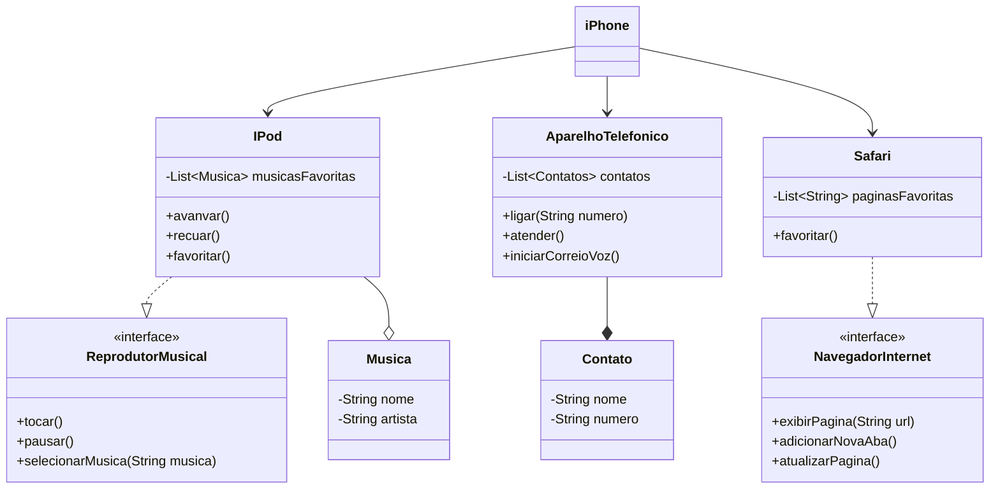

# POO - Desafio

## Modelagem e Diagramação de um Componente iPhone
Com base no vídeo de [Lançamento iPhone 2007](https://www.youtube.com/watch?v=9ou608QQRq8), foi elaborado o diagrama de classes.

### Funcionalidades a Modelar
1. **Reprodutor Musical**
   - Métodos: `tocar()`, `pausar()`, `selecionarMusica(String musica)`
2. **Aparelho Telefônico**
   - Métodos: `ligar(String numero)`, `atender()`, `iniciarCorreioVoz()`
3. **Navegador na Internet**
   - Métodos: `exibirPagina(String url)`, `adicionarNovaAba()`, `atualizarPagina()`
### Resultado

