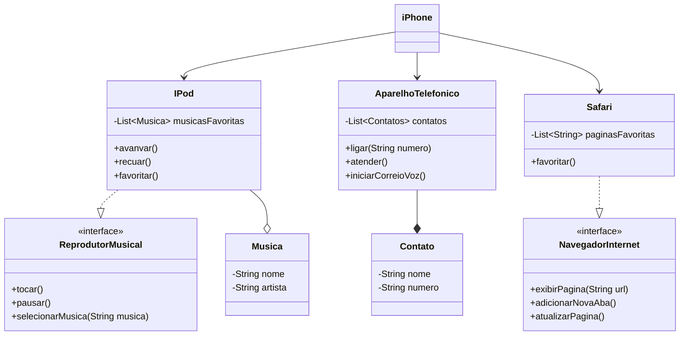

```mermaid
classDiagram
    class IPod {
        +avanvar()
        +recuar()
        +favoritar()
    }
    IPod : -List~Musica~ musicasFavoritas

    class AparelhoTelefonico {
        
        +ligar(String numero)
        +atender()
        +iniciarCorreioVoz()
    }
    AparelhoTelefonico : -List~Contatos~ contatos

    class Safari {
        +favoritar()
    }
    Safari : -List~String~ paginasFavoritas

    class iPhone {
    }

    class Musica {
        -String nome
        -String artista
    }

    class Contato {
        -String nome
        -String numero
    }

    class ReprodutorMusical{
    <<interface>>
    +tocar()
    +pausar()
    +selecionarMusica(String musica)
    }

    class NavegadorInternet{
    <<interface>>
    
    +exibirPagina(String url)
    +adicionarNovaAba()
    +atualizarPagina()
    }

    iPhone --> IPod
    iPhone --> AparelhoTelefonico
    iPhone --> Safari

    IPod ..|> ReprodutorMusical
    Safari ..|> NavegadorInternet

    IPod --o Musica
    AparelhoTelefonico --* Contato
```
